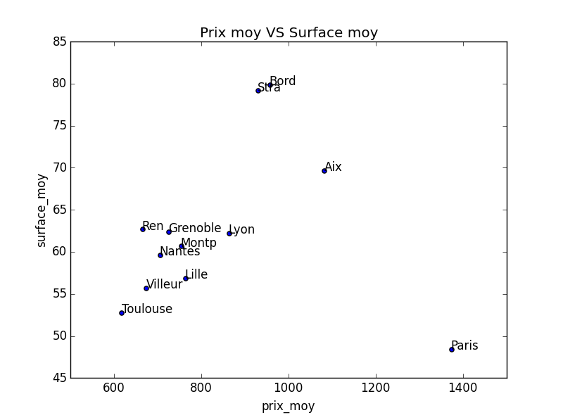
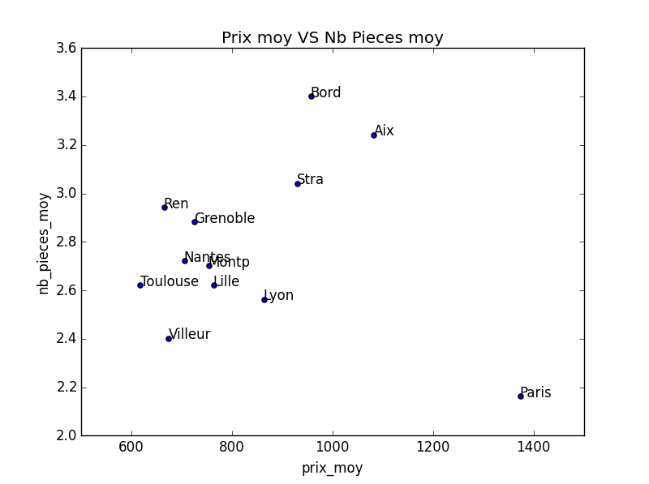

ImmobilierKitBigData
====================

Immobilier Kit BigData Telecom Paris  

# Bouygues Immobilier 
Veulent construire des logements  
pour des jeunes cadres dynamiques  
dans des villes de + de 50000 habitants  

## Questions
Ou doivent-il construire ?  
Que dois-je construire ? Typologie...  
Quel marketing ? Prenium, Freenium...  

## Bases de donnees
INSEE http://www.insee.fr/fr/themes/detail.asp?reg_id=99&ref_id=base-cc-logement-2011   
Seloger (api?crawl?)  
Pap (api?crawl?)  

